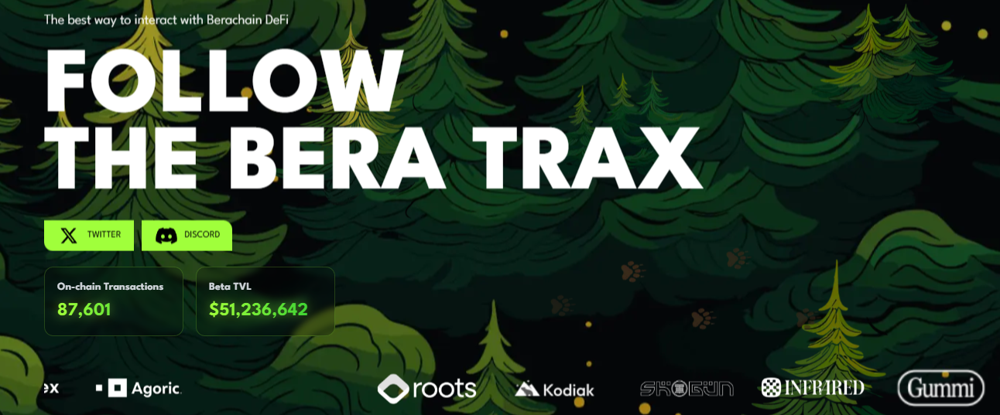

# beratrax Bot Auto claim bera faucet and auto stake


- website : [https://beratrax.com/](https://testnet.beratrax.com/GeognosticalBera)
## Features

- **Auto Claim Faucet Bera**
- **Auto Zap In And Stake Lp**
- **Auto Register Wallets**
- **Auto Generate New Wallets**
- **Support Proxy usage**

## Prerequisites

- Node.js installed on your machine
- All wallets mush have 0.001 Eth on ethereum mainnet to claim faucet bera 
- if you already have account registered just create `wallets.json` and input wallet details there
- look wallet example in `wallet-example.json`
- or just create new wallet using sc `npm run setup`
- Captcha ApiKey get one here http://2captcha.com or http://anti-captcha.com

## Installation

1. Clone the repository:
    ```sh
    git clone https://github.com/Zlkcyber/beratraxBot.git
    cd beratraxBot
    ```

2. Install the required dependencies:
    ```sh
    npm install
    ```
3. Create new wallets
    ```
    npm run setup
    ```
4. optionally you can use proxy: 
- paste proxy in `proxy.txt` format `http://username:password@ip:port` 
    ```sh
    nano proxy.txt
    ```
5. Run the script:
    ```sh
    npm run start
    ```

## All wallets information saved at `wallets.json`


## 

This project is licensed under the [MIT License](LICENSE).
